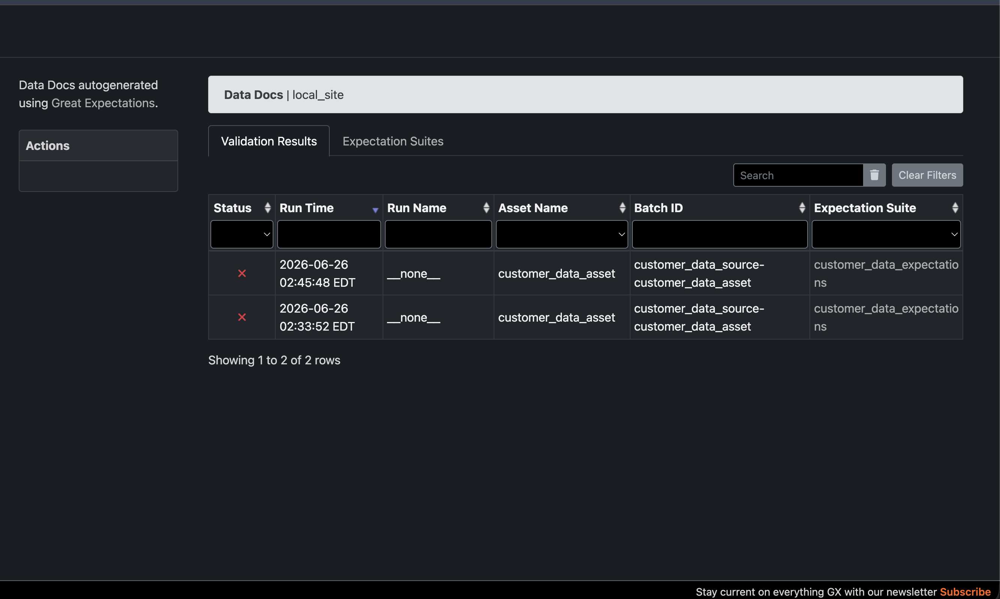

# Assignment 2 — Data Validation & Testing Report

**Course:** MAI201 MLOps
**Dataset:** `data/customer_data.csv` (the real provided dataset — 5,015 rows, 7 columns, converted from `customer_data.xlsx`)
**Tools:** Great Expectations 1.18, pytest 9.1, pandas

---

## 1. Great Expectations Validation Results

A file-based GE project was initialized in `./gx`, with a pandas filesystem
data source pointing at `data/customer_data.csv`, and the expectation suite
**`customer_data_expectations`** containing all 8 required expectations.

> **Note on row count:** the assignment brief specifies a row-count expectation
> of 500–1000, but the real dataset contains 5,015 rows. The expectation was
> adjusted to **4000–6000** to reflect the dataset actually provided.

| # | Expectation | Column | Result | Unexpected |
|---|---|---|---|---|
| 1 | `expect_column_values_to_not_be_null` | customer_id | ❌ FAIL | 150 |
| 2 | `expect_column_values_to_be_unique` | customer_id | ❌ FAIL | 568 |
| 3 | `expect_column_values_to_be_between` (0–120) | age | ❌ FAIL | 384 |
| 4 | `expect_column_values_to_match_regex` (email format) | email | ❌ FAIL | 346 |
| 5 | `expect_column_values_to_not_be_null` (mostly=0.95) | salary | ❌ FAIL | 425 |
| 6 | `expect_column_values_to_be_in_set` (USA/Canada/UK/Australia) | country | ❌ FAIL | 301 |
| 7 | `expect_column_values_to_match_regex` (date format) | signup_date | ❌ FAIL | 64 |
| 8 | `expect_table_row_count_to_be_between` (4000–6000) | — (table) | ✅ PASS | 5015 rows |

**Overall: 1 / 8 expectations passed (12.5% success rate), overall suite status: FAILED.**
This dataset is genuinely messy — the failures are expected and correctly caught
by the suite.

Great Expectations Data Docs (HTML) was generated at:
`gx/uncommitted/data_docs/local_site/index.html`

### Screenshot — Validation Results



---

## 2. Data Quality Issues Found (with counts)

An independent pandas-based audit (`run_validation.py → compute_issue_counts()`)
was run against the same CSV to produce exact counts per issue type, out of
**5,015 total rows**:

| Issue | Count | % of rows |
|---|---|---|
| Missing `customer_id` | 150 | 2.99% |
| Duplicate `customer_id` rows | 303 | 6.04% |
| Fully duplicate rows | 15 | 0.30% |
| Missing `age` | 147 | 2.93% |
| `age` out of range (>120 or negative, incl. sentinel values like 999/-999) | 384 | 7.66% |
| Missing `email` | 438 | 8.73% |
| Invalid `email` format | 346 | 6.90% |
| Missing `salary` | 425 | 8.47% |
| Negative `salary` | 159 | 3.17% |
| Missing `country` | 41 | 0.82% |
| Invalid `country` (not USA/Canada/UK/Australia — incl. out-of-scope countries and `"InvalidCountry"`) | 342 | 6.82% |
| Missing `phone` | 319 | 6.36% |
| Inconsistent `phone` format (not `###-###-####`) | 3,906 | 77.89% |
| Missing `signup_date` | 14 | 0.28% |

Raw JSON: `data_quality_issue_counts.json`

---

## 3. pytest Unit Tests

Three data utility functions (`data_utils.py`) were tested with 33 pytest
cases (`test_data_utils.py`) covering normal, edge, and invalid inputs:

- **`load_csv(filepath)`** — file-not-found, empty file, header-only file, and
  successful load (4 tests)
- **`clean_phone(phone)`** — 8 varied valid input formats normalizing to a
  consistent `###-###-####` output, plus 6 invalid/edge inputs returning `""` (15 tests)
- **`validate_email(email)`** — 4 valid emails, 7 invalid emails, 2 edge-case
  inputs (`None`, `NaN`), and a return-type check (14 tests)

**Result: 33 / 33 tests passed.**

### Screenshot — pytest Execution


---

## 4. Reflection: Which Data Quality Issue Would Most Impact ML Model Performance?

Of all the issues found in this dataset, **the `age` and `salary` corruption —
sentinel/out-of-range values (e.g. `age = 999`, `age = -999`) and missing or
negative salaries — would most damage ML model performance**, for a few reasons:

1. **Sentinel values masquerade as real data.** Values like `age = 999` or
   `age = -999` are clearly placeholders for "unknown," but unless explicitly
   filtered, a model will treat them as legitimate numeric ages. A handful of
   999s can drag a feature's mean and standard deviation far from its true
   distribution, corrupting any normalization or scaling applied to the whole
   column — and therefore every other row's value for that feature.
2. **They're silent.** Unlike a missing email (`NaN`, easy to detect with
   `isnull()`), a wrong-but-plausible numeric value passes type checks and
   basic null checks without complaint. It only surfaces once it's already
   distorted model weights or skewed predictions.
3. **High prevalence here.** With `age` out-of-range in **7.66%** of rows and
   `salary` missing or negative in over **11%** of rows combined, this isn't a
   rare edge case — it's a substantial fraction of the dataset that would
   meaningfully bias any model trained on these columns as numeric features.

By contrast, inconsistent phone formatting (the single largest issue by count,
at 77.89% of rows) has little effect on a typical ML pipeline, since phone
numbers are rarely used as direct model inputs — it matters far more for
downstream operational use (e.g. contacting a customer) than for prediction
quality.

---

## 5. Project Structure

```
assignment2_real/
├── data/
│   └── customer_data.csv              # the real dataset (converted from xlsx)
├── gx/                                # Great Expectations project (Parts 1–3)
│   └── uncommitted/data_docs/local_site/index.html
├── setup_ge.py                        # Parts 1 & 2: GE init, datasource, 8 expectations
├── run_validation.py                  # Part 3: run checkpoint, build Data Docs, audit issues
├── data_utils.py                      # Part 4: load_csv, clean_phone, validate_email
├── test_data_utils.py                 # Part 4: 33 pytest unit tests
├── data_quality_issue_counts.json     # Part 3 output
├── screenshots/                       # Part 5 screenshots
└── assignment2_report.md              # this report
```

## 6. How to Reproduce

```bash
pip install "great_expectations>=1,<2" pytest pandas --break-system-packages
python3 setup_ge.py             # Parts 1 & 2: GE project + 8 expectations
python3 run_validation.py       # Part 3: validation run + Data Docs + issue counts
python3 -m pytest test_data_utils.py -v   # Part 4: 33 unit tests
```
