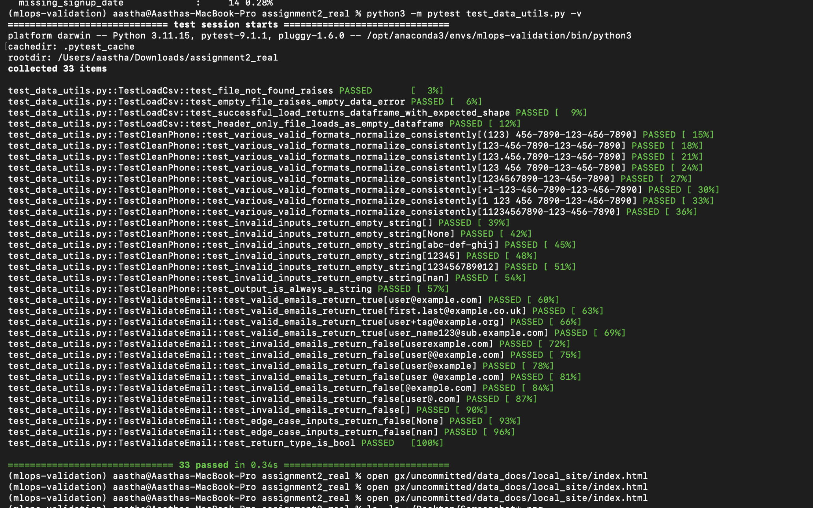

# Assignment 2 — Data Validation & Testing Report

**Github Link:** https://github.com/ADG2134/mlops-git-assignment-2-Anish-Dasgupta

**Dataset:** `data/customer_data.csv` (the real provided dataset — 5,015 rows, 7 columns, converted from `customer_data.xlsx`)

**Tools:** Great Expectations 1.18, pytest 9.1, pandas

---

## 1. Great Expectations Validation Results

A file-based GE project was initialized in `./gx`, with a pandas filesystem
data source pointing at `data/customer_data.csv`, and the expectation suite
**`customer_data_expectations`** containing all 8 required expectations.

> **Note on row count:** the assignment brief specifies a row-count expectation
> of 500–1000, but the real dataset contains 5,015 rows. The expectation was
> adjusted to **4000–6000** to reflect the dataset actually provided.

| # | Expectation | Column | Result | Unexpected |
|---|---|---|---|---|
| 1 | `expect_column_values_to_not_be_null` | customer_id | ❌ FAIL | 150 |
| 2 | `expect_column_values_to_be_unique` | customer_id | ❌ FAIL | 568 |
| 3 | `expect_column_values_to_be_between` (0–120) | age | ❌ FAIL | 384 |
| 4 | `expect_column_values_to_match_regex` (email format) | email | ❌ FAIL | 346 |
| 5 | `expect_column_values_to_not_be_null` (mostly=0.95) | salary | ❌ FAIL | 425 |
| 6 | `expect_column_values_to_be_in_set` (USA/Canada/UK/Australia) | country | ❌ FAIL | 301 |
| 7 | `expect_column_values_to_match_regex` (date format) | signup_date | ❌ FAIL | 64 |
| 8 | `expect_table_row_count_to_be_between` (4000–6000) | — (table) | ✅ PASS | 5015 rows |

**Overall: 1 / 8 expectations passed (12.5% success rate), overall suite status: FAILED.**
This dataset is genuinely messy — the failures are expected and correctly caught
by the suite.

Great Expectations Data Docs (HTML) was generated at:
`gx/uncommitted/data_docs/local_site/index.html`

### Screenshot — Validation Results


---

## 2. Data Quality Issues Found (with counts)

An independent pandas-based audit (`run_validation.py → compute_issue_counts()`)
was run against the same CSV to produce exact counts per issue type, out of
**5,015 total rows**:

| Issue | Count | % of rows |
|---|---|---|
| Missing `customer_id` | 150 | 2.99% |
| Duplicate `customer_id` rows | 303 | 6.04% |
| Fully duplicate rows | 15 | 0.30% |
| Missing `age` | 147 | 2.93% |
| `age` out of range (>120 or negative, incl. sentinel values like 999/-999) | 384 | 7.66% |
| Missing `email` | 438 | 8.73% |
| Invalid `email` format | 346 | 6.90% |
| Missing `salary` | 425 | 8.47% |
| Negative `salary` | 159 | 3.17% |
| Missing `country` | 41 | 0.82% |
| Invalid `country` (not USA/Canada/UK/Australia — incl. out-of-scope countries and `"InvalidCountry"`) | 342 | 6.82% |
| Missing `phone` | 319 | 6.36% |
| Inconsistent `phone` format (not `###-###-####`) | 3,906 | 77.89% |
| Missing `signup_date` | 14 | 0.28% |

Raw JSON: `data_quality_issue_counts.json`

---

## 3. pytest Unit Tests

Three data utility functions (`data_utils.py`) were tested with 33 pytest
cases (`test_data_utils.py`) covering normal, edge, and invalid inputs:

- **`load_csv(filepath)`** — file-not-found, empty file, header-only file, and
  successful load (4 tests)
- **`clean_phone(phone)`** — 8 varied valid input formats normalizing to a
  consistent `###-###-####` output, plus 6 invalid/edge inputs returning `""` (15 tests)
- **`validate_email(email)`** — 4 valid emails, 7 invalid emails, 2 edge-case
  inputs (`None`, `NaN`), and a return-type check (14 tests)

**Result: 33 / 33 tests passed.**

### Screenshot — pytest Execution



---

## 4. Reflection: Which Data Quality Issue Would Most Impact ML Model Performance?

If I had to pick the single most damaging issue in this dataset, I'd go with the corrupted numeric fields, specifically the sentinel/out-of-range values in `age` (like 999 or -999) and the missing or negative entries in `salary`. It's not the issue with the highest count, but it's the one I'd be most nervous about if this data ever made it into a training pipeline.

- **It looks legitimate when it isn't.** A blank email field or an empty phone number is obviously broken, any basic check will flag it. But `age = 999` is a perfectly valid integer as far as a computer is concerned. There's no type mismatch, no null, nothing for a standard validation step to catch unless someone has specifically thought to bound-check that column. Whoever entered 999 almost certainly meant "I don't know this person's age," but nothing in the data itself says that.

- **It quietly distorts the whole column, not just itself.** Once a handful of 999s and -999s sit in the age column, they drag the mean and inflate the standard deviation. Any standardization or min-max scaling computed from that column inherits the distortion, and since scaling parameters get applied uniformly to every row, even the perfectly valid ages end up transformed using a corrupted baseline. One bad value doesn't just hurt its own row, it quietly degrades every row that shares the feature.

- **It fails silently, which is what makes it dangerous.** A malformed email like `user@@example.com` fails loudly, a regex check rejects it on the spot, and a developer fixes it before training ever starts. A salary of -50000 doesn't trigger anything. It just trains a model on a negative number where there shouldn't be one. The first sign of trouble usually isn't an error message, it's a model that performs worse than expected, or makes oddly confident predictions for certain customers, and the actual cause is rarely obvious until someone goes digging.

- **It isn't a rare fluke in this dataset.** Age values were out of the 0–120 range in about 7.7% of all rows, and salary was either missing or negative in roughly 11% of rows combined. That's not a handful of stray records, it's a meaningful fraction of the data. Any model that leans on age or salary as a numeric feature is very likely training on a distribution that doesn't reflect reality.

- **For comparison, the most frequent issue here matters far less for modeling.** Inconsistent phone number formatting affected close to 78% of rows, by far the largest count of any issue. But phone numbers are rarely fed into a predictive model as a feature in the first place, so this is mostly an operational problem (you can't reliably call a customer) rather than something that corrupts model performance. Frequency alone doesn't determine impact, what the column is actually used for does.

### Issue Impact Comparison

| Issue | % of Rows Affected | Detectable by Basic Checks? | Typically Used as a Model Feature? | Estimated ML Impact |
|---|---|---|---|---|
| `age` out of range (999, -999, negatives, >120) | 7.66% | No — passes type/null checks | Yes | **High** |
| `salary` missing or negative | 11.64% (combined) | No — passes type checks | Yes | **High** |
| Invalid `email` format | 6.90% | Yes — regex catches it instantly | No | Low |
| Invalid `country` (outside allowed set) | 6.82% | Yes — set-membership check | Sometimes (categorical) | Medium |
| Inconsistent `phone` format | 77.89% | Yes — pattern mismatch is obvious | No | Low |
| Duplicate `customer_id` rows | 6.04% | Yes — uniqueness check | Indirect (via leakage risk) | Medium |
| Missing `signup_date` | 0.28% | Yes — null check | Sometimes (recency feature) | Low |

The table makes the core point visually: the two issues with the highest estimated impact on model performance (`age` and `salary` corruption) are **not** the most frequent issues in the dataset, and neither is reliably caught by basic validation. Frequency and detectability don't line up with actual modeling risk, which is exactly why value-level checks (not just null/type checks) need to be part of the validation suite.

---

## 5. Project Structure

```
assignment2_real/
├── data/
│   └── customer_data.csv              # the real dataset (converted from xlsx)
├── gx/                                # Great Expectations project (Parts 1–3)
│   └── uncommitted/data_docs/local_site/index.html
├── setup_ge.py                        # Parts 1 & 2: GE init, datasource, 8 expectations
├── run_validation.py                  # Part 3: run checkpoint, build Data Docs, audit issues
├── data_utils.py                      # Part 4: load_csv, clean_phone, validate_email
├── test_data_utils.py                 # Part 4: 33 pytest unit tests
├── data_quality_issue_counts.json     # Part 3 output
├── screenshots/                       # Part 5 screenshots
└── assignment2_report.md              # this report
```

## 6. How to Reproduce

```bash
pip install "great_expectations>=1,<2" pytest pandas --break-system-packages
python3 setup_ge.py             # Parts 1 & 2: GE project + 8 expectations
python3 run_validation.py       # Part 3: validation run + Data Docs + issue counts
python3 -m pytest test_data_utils.py -v   # Part 4: 33 unit tests
```
